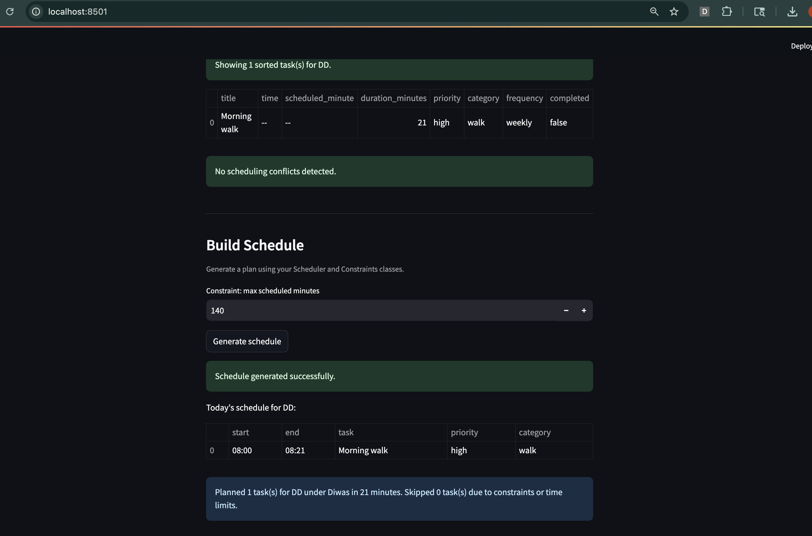

# PawPal+ (Module 2 Project)

You are building **PawPal+**, a Streamlit app that helps a pet owner plan care tasks for their pet.

## Scenario

A busy pet owner needs help staying consistent with pet care. They want an assistant that can:

- Track pet care tasks (walks, feeding, meds, enrichment, grooming, etc.)
- Consider constraints (time available, priority, owner preferences)
- Produce a daily plan and explain why it chose that plan

Your job is to design the system first (UML), then implement the logic in Python, then connect it to the Streamlit UI.

## What you will build

Your final app should:

- Let a user enter basic owner + pet info
- Let a user add/edit tasks (duration + priority at minimum)
- Generate a daily schedule/plan based on constraints and priorities
- Display the plan clearly (and ideally explain the reasoning)
- Include tests for the most important scheduling behaviors

## Getting started

### Setup

```bash
python -m venv .venv
source .venv/bin/activate  # Windows: .venv\Scripts\activate
pip install -r requirements.txt
```

### Suggested workflow

1. Read the scenario carefully and identify requirements and edge cases.
2. Draft a UML diagram (classes, attributes, methods, relationships).
3. Convert UML into Python class stubs (no logic yet).
4. Implement scheduling logic in small increments.
5. Add tests to verify key behaviors.
6. Connect your logic to the Streamlit UI in `app.py`.
7. Refine UML so it matches what you actually built.

## Smarter Scheduling

The scheduler now includes several practical planning upgrades:

- **Score-per-minute ranking** to prioritize high-impact tasks when time is limited.
- **Recurring task handling** so completing a `daily` or `weekly` task auto-creates the next occurrence using `timedelta`.
- **Time-based sorting** for tasks with `HH:MM` values.
- **Flexible filtering** by completion status and pet name.
- **Conflict detection warnings** that flag overlapping tasks (same pet or different pets) without crashing the app.
- **Time-window placement** and anti-starvation scoring to make schedules more realistic and balanced.

## Features

- **Sorting by time:** Chronological ordering using `HH:MM` task times, with fallback to `scheduled_minute` and unscheduled tasks placed last.
- **Priority density ranking:** Score-per-minute ranking to maximize impact when available time is limited.
- **Anti-starvation boost:** Skip-streak bonus increases priority for repeatedly skipped tasks.
- **Constraint-aware planning:** Enforces owner availability and optional `max_total_minutes` limits.
- **Time-window placement:** Places tasks into valid allowed windows while avoiding overlaps.
- **Conflict warnings:** Detects and reports overlapping tasks (same pet or across pets) without failing schedule generation.
- **Flexible filtering:** Filters tasks by completion status and pet name.
- **Daily/weekly recurrence:** Completing recurring tasks auto-creates the next occurrence using `timedelta`.
- **Plan explanation:** Generates a clear summary of planned vs. unscheduled tasks and total scheduled time.

## Demo (Final Streamlit App)

Run the app locally:

```bash
streamlit run app.py
```

Then open the local URL shown by Streamlit (usually `http://localhost:8501`).

<a href="/course_images/ai110/your_screenshot_name.png" target="_blank"></a>

The final demo supports:

- Managing owner profile and multiple pets
- Adding tasks with duration, priority, category, and frequency
- Viewing sorted/filtered task tables
- Seeing conflict warnings in real time
- Generating a daily schedule with explanation and unscheduled-task reasons

## Testing PawPal+

Run the automated tests with:

```bash
python -m pytest
```

Current result: **16 passed in 0.03s**.

The test suite covers core scheduling reliability, including:

- Task completion state updates
- Adding tasks to pets
- Sorting tasks by scheduled minute and `HH:MM` time
- Filtering by pet and completion status
- Recurring task behavior (`daily`/`weekly` next-task creation)
- Overlap/conflict detection (same pet and across pets)
- Rank/selection behavior (score-per-minute and anti-starvation)
- Placement within allowed time windows

**Confidence Level:** ⭐⭐⭐⭐⭐ (5/5)
